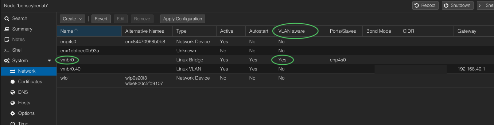
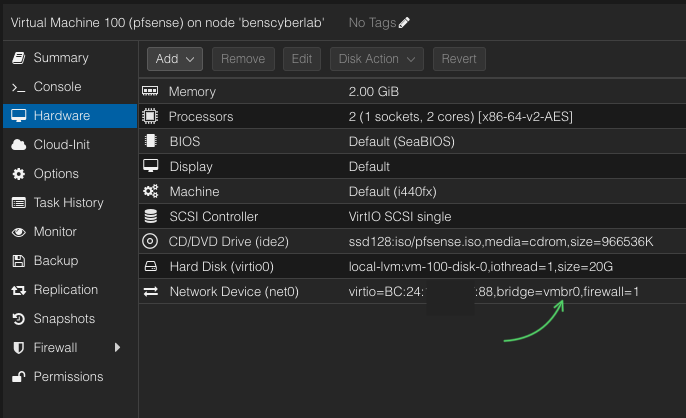
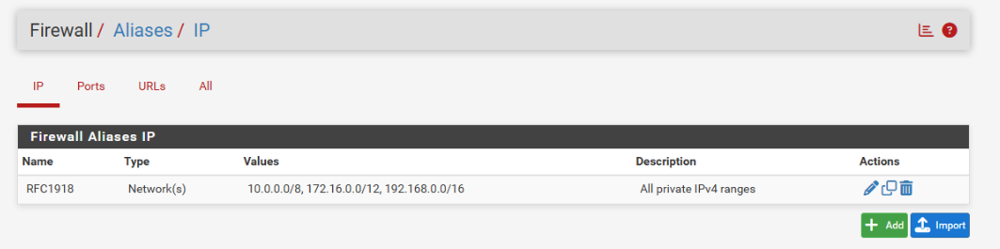
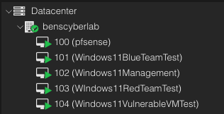
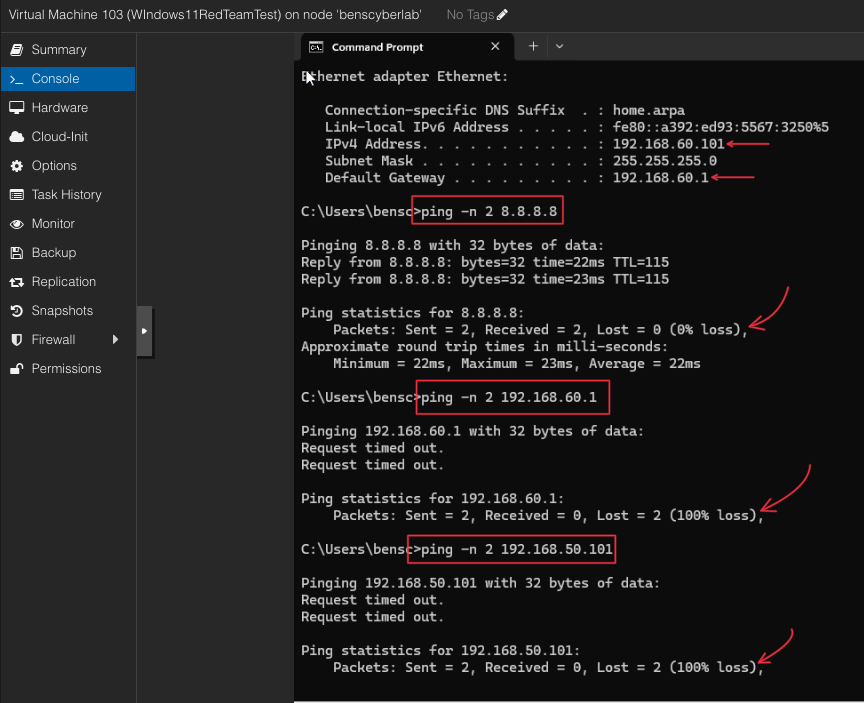

# Built isolated networks as the foundation of an enterprise-level cybersecurity home lab

## 1. Project Overview

This project is part of my ongoing **enterprise-level cybersecurity home lab build**.  

The goal was to design and implement network segmentation and firewall controls for **isolated Blue Team, Red Team, and Vulnerable environments** using **Proxmox** and **pfSense**.

By deploying pfSense as the virtual router and firewall within Proxmox, I created multiple VLANs to separate traffic, enforce access control, and simulate realistic scenarios for cybersecurity practice and testing.

This configuration lays the foundation for advanced lab exercises covering:

- **Blue Team activities** – network monitoring, intrusion detection, incident response, and threat hunting.
- **Red Team activities** – penetration testing, exploit development, and adversary simulation.

This lab serves as a **dedicated environment** for learning, practicing, and safely testing cybersecurity tools and techniques, with capacity for **future expansion** into more advanced scenarios.

*Figure 1: Network diagram showing VLAN segmentation and pfSense placement within the Proxmox environment.*

---

## Lab Hardware

- **GMKtec K10 Mini PC**: Intel 13th Core i9-13900HK 14-core / 20-thread CPU, 96GB RAM, 2TB NVMe SSD
- **Hypervisor**: Proxmox VE
- **Networking**: VLAN-aware bridge configuration
- **Firewall/Router**: pfSense virtualized within Proxmox

---

## 2. Proxmox Network Setup

During this process, I considered two different options:

- **Option 1**: Create a VLAN-aware bridge (`vmbr0`) and, on the pfSense VM hardware settings, add five different network interfaces with `vmbr0` as the bridge but assign each interface a different VLAN ID (45 for WAN, 46 for LAN, 50 for Blue Team, 60 for Red Team, and 70 for Vulnerable Machines).

- **Option 2**: Create a VLAN-aware bridge (`vmbr0`) and pass only that bridge as a single network interface without any VLAN ID, then create the VLANs inside pfSense interfaces.

I decided to go with **Option 2**, which is what I implemented in this project.

*Figure 2: Proxmox vmbr0 bridge configuration showing VLAN awareness enabled*

---

## 3. pfSense VM Network Configuration

Under **pfSense → Hardware → Network**, I selected `vmbr0` as the bridge but did not pass any VLAN ID so I could handle all creation and assignments within pfSense interfaces.

*Figure 3: pfSense Hardware Settings on Proxmox Showing Network Interface*

### pfSense Installation and Initial Setup
After installing pfSense and accessing the console, I created the **WAN** and **LAN** VLANs (45 and 46 respectively) and assigned them to their respective interfaces. I also set a static IP address on the LAN side (`192.168.46.1`) so I could log in from the GUI and complete the setup of the remaining interfaces.

I created a Windows VM for pfSense LAN management and added it to **VLAN 46** so I could log in to the GUI. After login, I went to **Interfaces → VLANs** and created the remaining VLANs (50, 60, and 70) for Blue Team, Red Team, and Vulnerable Machines respectively.

*Figure 4: pfSense VLAN interface showing VLANI IDs*

| VLAN ID | Purpose            |
|---------|-------------------|
| 50      | Blue Team network |
| 60      | Red Team network  |
| 70      | Vulnerable Machines |

---
### Interface Assignment
After creating the VLAN IDs, I went to **Interfaces → Interface Assignments** and assigned each VLAN to its respective interface.

*Figure 5: pfSense interface assignments showing VLAN interfaces*

---

## 4. DHCP and IP Addressing

### Interface Configuration
I activated and configured each interface for VLANs 50, 60, and 70, assigning a static IPv4 address corresponding to their VLAN IDs:

- `192.168.50.1` for Blue Team (VLAN 50)  
- `192.168.60.1` for Red Team (VLAN 60)  
- `192.168.70.1` for Vulnerable VMs (VLAN 70)  

| VLAN | Subnet            | Gateway IP     |
|------|-------------------|----------------|
| 50   | 192.168.50.0/24   | 192.168.50.1   |
| 60   | 192.168.60.0/24   | 192.168.60.1   |
| 70   | 192.168.70.0/24   | 192.168.70.1   |

---

### DHCP Server for Each Interface
Under **Services → DHCP Server** in pfSense, I enabled DHCP for each VLAN and set the address pool range to `192.168.x.100 – 192.168.x.150` for each VLAN interface.

---

## 5. Firewall Rules Overview

I used an **allowlist approach**, blocking all traffic by default and only allowing necessary connections.

### Creating Aliases
- **RFC1918** – private IP ranges
- **Internet_Ports** – ports 80 (HTTP) and 443 (HTTPS)

*Figure 6&7: Aliases: RFC1918 and Internet_Ports*

---

### VLAN Rules
- **VLANs 50, 60, 70** – blocked all outbound connections to other VLANs using RFC1918 alias.
- **VLANs 50 & 60** – allowed TCP/UDP on port 53 (DNS) and to Internet_Ports for HTTP/HTTPS.
- **VLANs 50 & 60** – allowed ICMP echo (ping) for connectivity checks.
- **VLAN 70** – no outbound connections allowed.

*Figure 8: Example firewall rules for VLAN 50 (BLue Team)*

*Figure 9: Example firewall rules for VLAN 70 (Vulnerable VMs)*

---

## 6. Testing and Verification

I created three Windows 11 VMs, each tagged with VLANs 50, 60, and 70.

*Figure 10: Windows 11 Virtual Machines (VMs) setup on each subnet for testing*

**Tests Performed:**
- Verified correct IP via `ipconfig`
- Pinged:
  - DNS server (8.8.8.8)
  - Subnet gateway
  - Host on another subnet

**Results:**
- VLAN 70 (Vulnerable) – no outbound replies.
- VLANs 50 & 60 – DNS and internet pings OK, no inter-VLAN communication.

**Conclusion:**
- VLAN isolation and firewall rules working as intended.

*Figure 11: Ping results for VLAN 50 (BLue Team)*

*Figure 12: Ping results for VLAN 60 (Red Team)*

*Figure 13: Ping results for VLAN 70 (Vulnerable VMs)*

---

## 7. Lessons Learned and Next Steps

### Key Takeaways
- Better understanding of VLAN tagging at hypervisor vs. VM level.
- Importance of firewall rule order.
- Hands-on troubleshooting with DHCP and interface assignment.

### Planned Enhancements
- Expand the lab with Blue and Red Team tools.
- Adjust firewall rules as needed once the lab is fully operational.

---
